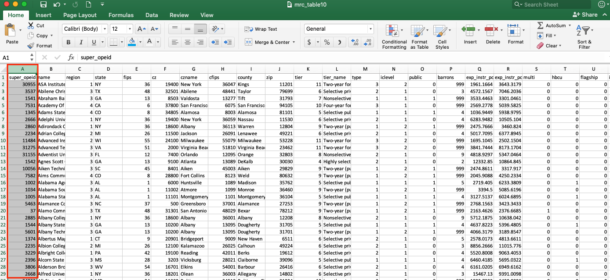
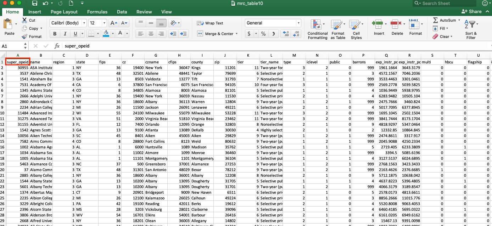
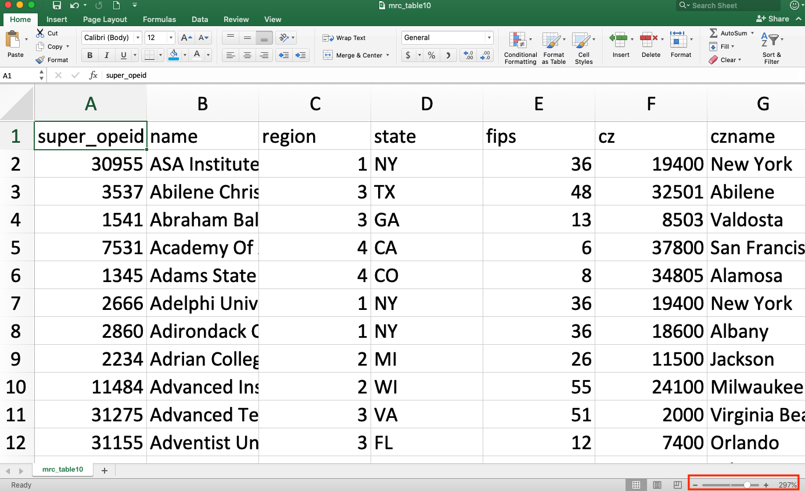
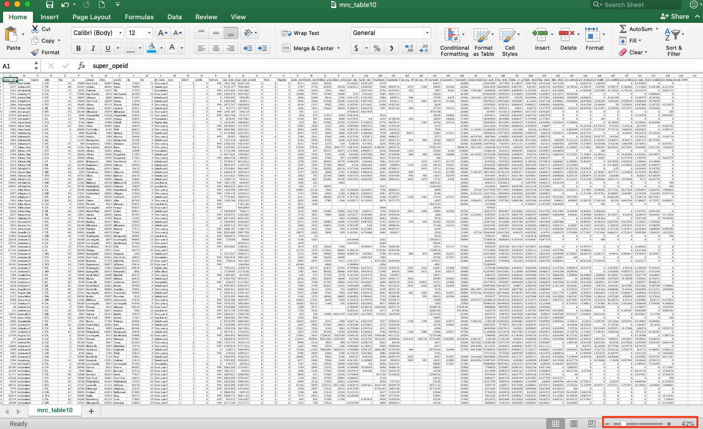
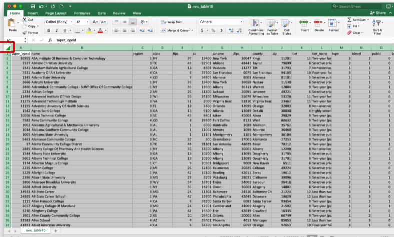
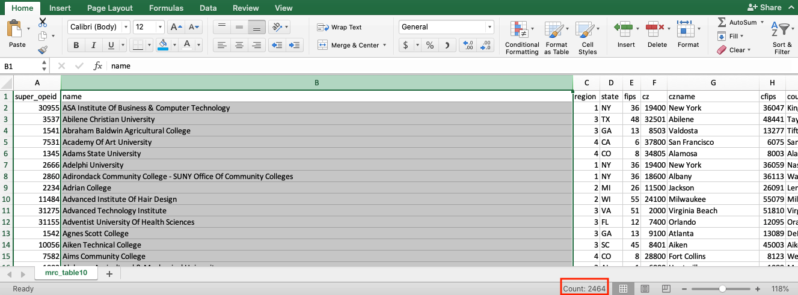
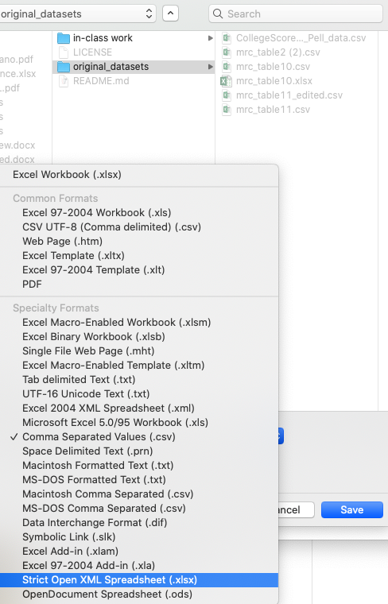
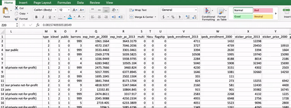
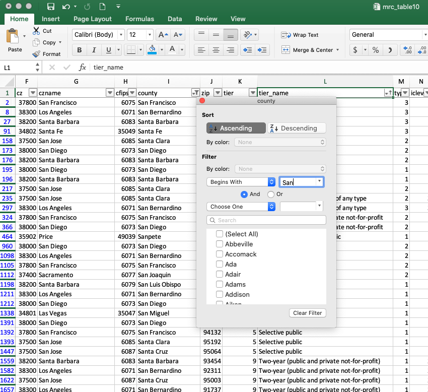

# Understanding Big Picture Information about your Data

## Excel Basics

### Rows, Columns, and Reformatting

Our Excel spreadsheet is made up of **columns** identified by letters:

and **rows** identified by numbers:

which make up a bunch of **cells** in the body of our Excel sheet, where we can input and manipulate data for our analyses. 

If we want to get a better view of the data inside our Excel sheet, we can always zoom in or zoom out using the cursor on the bottom right corner of our spreadsheet

We also notice that our Excel sheet auto formats so that each row and column is a standard width, however, this doesn’t always show all of the information that we want to see for each row \(for example, look at column B, which lists the US college names\). We can manually change the width of our columns and rows by hovering over the line between the columns that we want to adjust until our cursor changes to a vertical black line with two arrows pointing to the right and to the left of the line. Then, we can click and drag our column to change the width of either of the columns adjacent to that line. 

This is helpful if we want to quickly see what’s hidden in one of our top columns, but we’re limited by what we can see in our current view. We have over 2,000 rows in this dataset, so it’d take a long time \(and would be very inefficient\) if we scrolled through to make sure that our column was properly formatted for all of our rows. We can auto-adjust our columns to perfectly fit our data in our entire column by hovering over the line in between our columns again and then double-clicking when our icon changes to the vertical line with two arrows:  

We can also do this for all of our columns at the same time by clicking on the small grey box at the top left  of our dataset to highlight all of the cells in our Excel document: 

and then hovering over one of the column edges and double clicking when we see the line with two arrows. 

### Quickly Assessing the Data

We might want to know how much data we’re working with before we dive into any analysis as well. To find out how many rows our spreadsheet contains we can either scroll down to the bottom of the sheet to look at the row number, use the shortcut “COMMAND + down arrow key” on MacOS or “CTRL + down arrow key” in Windows to go to the last item in that column \(the edge of the spreadsheet\) to look at the row number for the last item in our dataset, or we can highlight the entire row by clicking on the column letter and look at the “count” at the bottom right corner.  

### Working with the Data in an Excel Document

So far, we've been playing around with our data in a CSV document even though we're working in Microsoft Excel. This is fine as long as we don't want to save any formulas, formatting, or data visualizations to our sheet. As a reminder, CSV stands for comma separated value, which means that CSV documents can only hold alphanumeric values, symbols, and commas. Anything else in the document will not save in the .csv file format, and Excel will usually prompt you to "make sure" that you want to save the file in a csv file format if you've made any of these other kinds of changes. 

Since we want to manipulate our data and save our work, we want to first save our CSV document as an Excel \(.xlsx or .xls\) document. For our class, saving files as an .xlsx vs. an .xls extension usually won't matter--xlsx files can be larger and have a bit more functionality, but sometimes take longer to open. To save your csv as an Excel file, go to File&gt;Save As... and then make sure to change the file extension to the "Strict Open XML Spreadsheet \(.xlsx\)" or "Excel 97-2004 Workbook \(.xls\)" file format with the same name.

### General Reformatting

Before we start playing around with our data, we might want to freeze our column header names so that we can keep track of what information we're looking at even if this is further down our Excel spreadsheet.

To do this, click on the "View" tab in the top "ribbon" menu bar, and then click "Freeze Top Row." 

You'll notice a darker black line appear underneath the first row. This will allow you to scroll through the entire dataset without losing the column headers.

If any of our data should in a specific kind of format such as currency, time, date, percentages, or anything else, we can easily reformat this in Excel by either: 

1. Highlighting the entire column and clicking on the quick format buttons under the Home ribbon menu bar
2. Clicking Format&gt;Cells to edit a more specific cell format
3. Typing "COMMAND" + "1" \(MacOS\) or "CONTROL" + "1" \(Windows\)

For example, if we want to edit column X \(sticker\_price\_2013\) to display the numbers as a US currency, we can highlight the column and click on the "$" and "decimal back" \(twice\) quick format buttons to reformat the numbers as a dollar value with no decimal places:

Alternatively, you can reformat the data using the Format menu options to do the same thing:

### Filtering Data

If we want to get a better idea of what's in our dataset, we might find the Excel Filter function useful to see how many "categories" of information are in each column. Excel filters can also help us preliminarily sort our information to see the largest, smallest, or specific subsets of information in specific columns with their corresponding data in other columns. 

To add filter options in our dataset:

1. Make sure you only have one cell in your dataset selected, or select the only column\(s\) that you want to add filters to
2. Click on the Filter icon in the top right corner
3. Select "Filter"

Notice that now all of the column headers now have a tiny arrow on the right side of their cells. Clicking on these arrows allows you to see how the information in your column might be sorted and view specific subsets of the data here. For example, if we want to see how many "tiers" the colleges are sorted into, we can click the arrow next to "tier" under column K to see that there are 12 tiers of colleges represented in this dataset:

We can then sort this column by Ascending \(smallest to largest number or A to Z\) or Descending \(largest to smallest number or Z to A\) order, select specific "groups" of data that we want to view, or create a logic statement to view conditional data. For example, if we wanted to view only colleges in cities that were located in a counties that started with "San" \(e.g. San Diego"\), then we could create a logic statement to view only this data: 

And our column data would automatically filter to only view county names that begin with "San."

